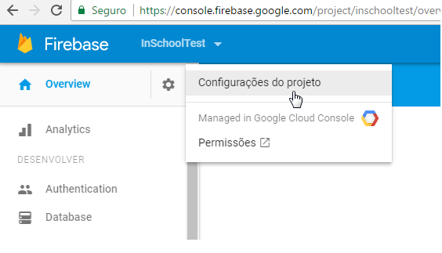
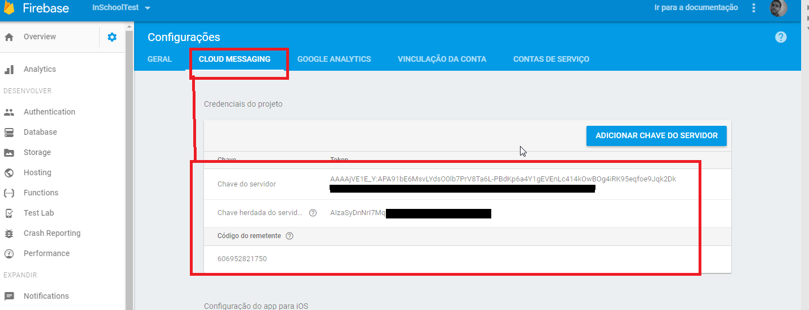

# Curso   
https://www.schoolofnet.com/curso-pwa-com-vuejs/


# check-list

> A Vue.js project

## Build Setup

``` bash
# install dependencies
npm install

# serve with hot reload at localhost:8080
npm run dev

# build for production with minification
npm run build

# build for production and view the bundle analyzer report
npm run build --report
```

For detailed explanation on how things work, checkout the [guide](http://vuejs-templates.github.io/webpack/) and [docs for vue-loader](http://vuejs.github.io/vue-loader).


Dados do Postman
[POST] https://fcm.googleapis.com/fcm/send 


HEADERS
```
Content-Type application/json
Authorization key=CHAVE_DO_SERVIDOR
```
CHAVE_DO_SERVIDOR = https://console.firebase.google.com/project/

  
  


```
{
  "registration_ids": [
    "ID_DO_REGISTRATION"
  ],
  "notification" : {
    "title" : "Mensagem para o Firebase",
	"body" : "Teste firebase"
  },"data" : {
    "nome" : "Gabriel Darezzo"
  }
}
```

### Caso não queira usar o PostMan, e já criar um servidor direto, tem um carinha bem simples em php, q simplesmente precisa enviar os registration_ids em forma de ID   
https://github.com/mattg888/GCM-PHP-Server-Push-Message